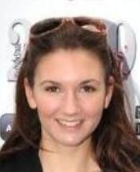
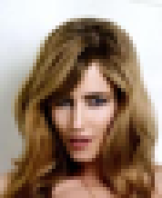

# Super Resolution Generative Adversarial Network

## Introduction
This repository is a python3/tensorflow implementation of the paper: [Photo-Realistic Single Image Super-Resolution Using a Generative Adversarial Network](https://arxiv.org/abs/1609.04802)

The model receives an image of arbitrary size and scales up by a factor of 16 (4 x 4)

## Requirements
* python >= 3.5
* tensorflow (tested with version 1.8.x)
* pillow
* numpy
* tqdm
* Pre-trained models:
  * [CelebA](https://drive.google.com/open?id=1dzKXc63ZCAgT_X1cdgXVfjBaNzBQekdD)
  * imagenet (i'm still working on that!)

## Usage
1) Clone the github repository
```
git clone https://github.com/vhessel/srgan_tensorflow
cd srgan_tensorflow
```
2) Download the pre-trained CelebA model and extract it to the checkpoint directory
3) Put the images in the folder inference
4) To load every image in the folder inference and write the super-resolution versions to folder output, simply run the following command:
```
python main.py
```
To get all the options:
```
python main.py -h
```
## CelebA Dataset
### Training
The model was trained in the [CelebA Align&Cropped Images](http://mmlab.ie.cuhk.edu.hk/projects/CelebA.html) in two rounds.
First, it ran 1e5 iterations with learning rate of 1e-5 (It took 36 hours in a GTX1080TI). After that, the discriminator was reseted and the model ran for another 1e5 iterations with learning rate of 1e-6 (It took another 36 hours in a GTX1080TI)

Due to restrictions of my personal hardware, the training phase used a batch size of 16 and a low-resolution image size of (44,52)

### CelebA Results

| Low Resolution| Bicubic Interpolation | SRGAN | Original |
:-------------------------:|:-------------------------:|:-------------------------:|:-------------------------:
 |  |  |  
 |  |  |  
 |  |  |  
 |  |  |  
 |  |  |  
 |  |  |  
 |  |  |  
 |  |  |  
 |  |  |  
 |  |  |  
